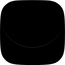

<picture>
  <source media="(max-width: 640px)" srcset="apps/extension/public/icon/icon.svg" width="0" height="0">
  <source srcset="apps/extension/public/icon/icon.svg" width="160" height="160">
  
</picture>

<h3>NewsNext</h3>

<em>Your personal dashboard. Live updates. Track changes. Spot trends.</em>

<a href="https://tally.so/r/yPBBYg"><strong>Join the waitlist →</strong></a>

 
 

The next official version of [ourongxing/newsnow](https://github.com/ourongxing/newsnow). NewsNext is not ready for release yet—join the [waitlist](https://tally.so/r/yPBBYg) to get notified when it officially launches. You can also use an agent to preview the current project and try it out.

**NewsNext is in early development. Expect frequent breaking changes.**

The browser extension works on its own. Use it with the CLI and SDK for the full
experience. The CLI is currently closed source, but will be open-sourced when
the time is right.
